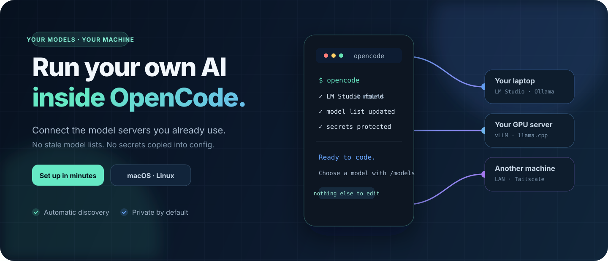

<div align="center">
  <h1>⚡ Modded OpenCode</h1>
  <p>OpenCode gerektirir — Desktop, Terminal ve CLI hepsi aynı config'i okur.</p>
  <p><strong>105 skill · 13 agent · 19 command · 6 plugin — açılışta her şey hazır</strong></p>
  <p>
    <a href="README.md">🇬🇧 English</a> ·
    <a href="README.ru.md">🇷🇺 Русский</a>
  </p>
  <p>
    <a href="https://github.com/tealaxdevelopers/modded-opencode"></a>
    <a href="https://github.com/tealaxdevelopers/modded-opencode/stargazers"></a>
    <a href="https://opencode.ai"></a>
  </p>
</div>

<p align="center">
  
</p>

---

## ⚡ Hızlı Başlangıç

### Windows
```batch
git clone https://github.com/tealaxdevelopers/Modded-OpenCode.git
cd Modded-OpenCode
setup.bat
```

### macOS / Linux
```bash
git clone https://github.com/tealaxdevelopers/Modded-OpenCode.git
cd Modded-OpenCode
chmod +x setup.sh scripts/*.sh
./setup.sh
```

> Provider kurulumu sihirbaza dahildir. OpenCode ayrı olarak yüklenmelidir: https://opencode.ai

---

## 🔌 Plugin'ler (6 yerleşik, npm'den yüklenir)

| Plugin | Ne Yapar |
|--------|----------|
| **agents-opencode** | Sıkıştırma bağlamı enjeksiyonu, hassas dosya engelleme, versiyon env var'ı |
| **auto-continue** | Boşta kalan / kopan oturumları otomatik devam ettirir (varsayılan açık) |
| **openai-system-merge** | Katı OpenAI-uyumlu sunucularda çoklu system message hatasını düzeltir |
| **update-checker** | Başlangıçta GitHub'dan yeni sürüm kontrol eder |
| **notify** | Görev tamamlanınca çapraz platform masaüstü bildirimleri |
| **session-title** | İlk kullanıcı mesajından otomatik oturum başlığı üretir |

Auto-continue ayarları (`<proje>/.opencode/auto-continue.json`):

```jsonc
{
  "enabled": true,
  "cooldown_ms": 8000,
  "max_consecutive": 8,
  "continue_on_error": false
}
```

---

## 🧩 MCP Server'lar

| Server | Açıklama | Durum |
|--------|----------|-------|
| **fetch** | URL'den içerik çekme | ✅ Aktif |
| **memory** | Kalıcı bellek (knowledge graph) | ✅ Aktif |
| **sequential-thinking** | Adım adım düşünme | ✅ Aktif |
| **time** | Tarih/saat sorgulama | ✅ Aktif |
| **github** | GitHub API entegrasyonu | 🔑 Key verildiyse aktif |
| **brave-search** | Web arama | 🔑 Key verildiyse aktif |
| *filesystem* | Dosya sistemi erişimi | ⛔ Varsayılan kapalı |

---

## 🔥 Skill'ler (105 adet)

### Dil & Framework

| Skill | Ne İşe Yarar |
|-------|-------------|
| **multi-language** | Python/Kotlin/Java/Node.js idiomik kod üretimi |
| **java-spring** | Spring Boot + constructor injection + validation |
| **pythonic-quality** | Pythonic idiom'lar, SOLID, Liskov-safe subtype'lar |
| **senior-fullstack** | React/Next/Node/GraphQL/PostgreSQL fullstack |
| **rust** | Ownership/borrowing, Result/Option, safe abstractions |

### Kalite & İnceleme

| Skill | Ne İşe Yarar |
|-------|-------------|
| **ponytail** | Token israfını önleyen karar merdiveni (YAGNI/stdlib/oneliner/MVP) |
| **claude-code-review** | Güvenlik, performans, doğruluk incelemesi |
| **claude-debug** | Sistemli hipotez tabanlı hata ayıklama |
| **claude-simplify** | Netlik ve karmaşıklık azaltma için yeniden düzenleme |
| **code-change-impact** | Kod değişiklikleri için patlama yarıçapı analizi |

### İçerik & İş

| Skill | Ne İşe Yarar |
|-------|-------------|
| **legal-advisor** | Hukuk araştırması, mevzuat analizi, lisans denetimi |
| **cto-advisor** | Tech debt analizcisi, ekip ölçekleme, teknoloji değerlendirme |
| **blogger** | Teknoloji/finans/liderlik blogları, podcast fikirleri, YouTube scriptleri |
| **deep-research** | Alıntı takibi ile çoklu kaynak web araştırması |

### Verimlilik

| Skill | Ne İşe Yarar |
|-------|-------------|
| **claude-commit** | Atomik staging ile geleneksel git commit |
| **claude-batch** | Birden fazla dosyayı aynı işlemle işleme |
| **claude-loop** | Çıkış koşulları ile görevi tekrarlama |
| **xlsx / pdf / docx** | Excel, PDF, Word belge işleme |

*+95 daha fazla skill `source/skills/` içinde*

---

## 🤖 Agent'lar (13 adet)

| Agent | Rol | Mod |
|-------|-----|-----|
| **@codebase** | Profil algılama ile çok dilli geliştirme | primary |
| **@orchestrator** | Stratejik planlama ve iş akışı koordinasyonu | primary |
| **@planner** | Salt okunur analiz ve uygulama planlama | primary |
| **@review** | Güvenlik, performans, en iyi uygulamalar için kod incelemesi | subagent |
| **@docs** | Dokümantasyon oluşturma ve bakım | subagent |
| **@ivan** | Kıdemli kod uygulayıcı | subagent |
| **@jester** | Alışılmadık düşünme için yüksek sıcaklık oracle'ı | subagent |
| **@oscar** | Kıdemli kod inceleyici | subagent |
| **@scout** | Araştırma ve planlama | subagent |
| **@blogger** | İçerik oluşturma (blog, podcast, YouTube) | primary |
| **@brutal-critic** | Çerçeve puanlaması ile içerik kalite incelemesi | subagent |
| **@em-advisor** | Mühendislik yönetimi rehberliği | primary |
| **@legal-advisor** | Lisans denetimi, uyumluluk, düzenleyici rehberlik | primary |

---

## ⚙️ Provider'lar

**Kurulumla birlikte hazır provider gelmez.** Config `provider: {}` olarak boş kurulur.

İki bağlantı yolu:

### 1) Sihirbazdan (Adım 6 → `[1]`)
Base URL + model adı + API key sorulup config'e işlenir.

### 2) Hazır sağlayıcılar (OpenAI, Anthropic, Google...)
```batch
opencode auth login
```

### Desteklenen yerel endpoint'ler

| Provider | Varsayılan URL | Port |
|----------|---------------|------|
| Ollama | `http://127.0.0.1:11434/v1` | 11434 |
| LM Studio | `http://127.0.0.1:1234/v1` | 1234 |
| vLLM | `http://127.0.0.1:8000/v1` | 8000 |
| llama.cpp | `http://127.0.0.1:8080/v1` | 8080 |

---

## 🔧 OpenAI-Uyumlu Provider Desteği

Özel provider'lar (vLLM, Ollama, llama.cpp, LM Studio, Hetzner, OVHcloud, Scaleway vb.) kutudan çıkar çıkmaz çalışır. `openai-system-merge` plugin'i, sıkı OpenAI-uyumlu sunucularda oluşan `400 BadRequestError: System message must be at the beginning` hatasınıbirden fazla system message'ı birleştirerek düzeltir.

---

## 📦 Kurulum

Her iki sihirbaz (`setup.bat` / `setup.sh`) aynı soruları sorar:

| Adım | Soru | Boş Bırakılırsa |
|------|------|-----------------|
| 1️⃣ Dil | `tr` / `us` / `ru` | — |
| 2️⃣ Kullanıcı adı | Windows kullanıcı adın | otomatik algılanır |
| 3️⃣ Hitap | Agent sana nasıl hitap etsin? | varsayılan |
| 4️⃣ GitHub API key(ler) | GitHub MCP için | atlanır, MCP kapalı |
| 5️⃣ Brave API key | Web araması için | atlanır, arama kapalı |
| 6️⃣ Ekstra entegrasyon | Özel provider menüsü | geç |

Seçtiğin dil `rules.md` içindeki agent konuşma dilini belirler.

> 🔑 **Key güvenliği:** Kabuk RC dosyalarına asla yazılmaz. macOS/Linux'da `.env.local` (`0600` izin) dosyasında saklanır. Windows'da `setx` ile kullanıcı ortam değişkenlerine yazılır (registry'de saklanır, elle kaldırılana kadar kalır).

| İşletim Sistemi | Saklama yöntemi |
|-----------------|-----------------|
| **Windows** | `setx` ile kullanıcı ortam değişkenleri (ör. `GITHUB_API_KEY`, `BRAVE_API_KEY`) |
| **macOS** | `~/Library/Application Support/opencode/local-setup/.env.local` |
| **Linux** | `~/.config/opencode/local-setup/.env.local` |

---

## 📜 Rules.md

Agent persona katmanı — OpenCode instruction sistemiyle yüklenir. Kimlik, ses ve çalışma stilini belirler. Dil ve hitap kurulumda yapılandırılır.

---

## 🔧 Geliştirme

```bash
# Kendi skill'ini ekle
mkdir source/skills/benim-skillim/
printf -- "---\nname: benim-skillim\ndescription: Bir seyler yapar\n---\n# Skill icerigi" > source/skills/benim-skillim/SKILL.md

# Sonra setup.bat'i tekrar calistir
```

Doğrulama:
```bash
npm run validate
```

---

## 🙏 Teşekkürler

- [opencode-ai/opencode](https://github.com/opencode-ai/opencode) — ana platform
- [awesome-opencode/awesome-opencode](https://github.com/awesome-opencode/awesome-opencode) — plugin/tema/agent listesi

---

## 📄 Lisans

MIT — kullan, değiştir, dağıt, forkla.

---

<div align="center">
  <sub>🔮 tealaxdevelopers</sub>
</div>
